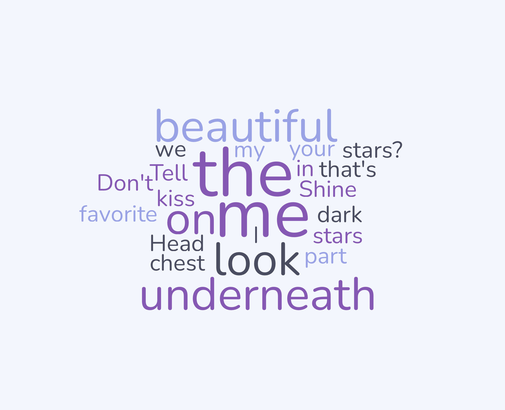
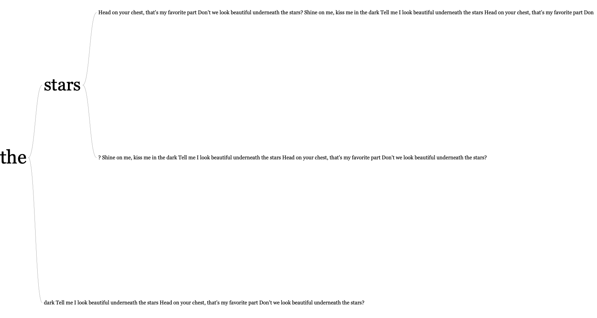

## Load Libraries
```{r, warning = FALSE, message = FALSE}
rm(list = ls())
library(mosaic)
library(tidyverse)
library(treemap)
library(devtools)
library(dplyr)
library(ggplot2)
library(plotly)
library(readxl)
knitr::opts_chunk$set(
echo = TRUE,
warning = FALSE,
message = FALSE
)
```

Exercises 1 and 2 will use the same text data. Students should pick the chorus of their favorite song and use the chorus to design (1) a Word Cloud, and (2) a Word Tree.

Using free online generators listed in each Exercise, students will use the textual structures generated to create a Canva presentation with two slides that depicts (1) a Word Cloud, and (2) a Word Tree.

See the solution posted on Canvas for more information.

Students cannot use the song **Twinkle, twinkle, little star.**

### Song Title

> Gimmie More

### Song Artist

> Britney Spears

### Chorus

> 
Shine on me, kiss me in the
dark Tell me I look
beautiful underneath the
stars Head on your chest,
that's my favorite part Don'
t we look beautiful
underneath the stars? Shine
on me, kiss me in the dark
Tell me I look beautiful
underneath the stars Head on
your chest, that's my
favorite part Don't we look
beautiful underneath the
stars?

## Exercise 1
Using the provided online [Word Cloud Generator](https://simplewordcloud.com/) or any free Word Cloud generator of your choosing, input your song's chorus and embed the results below.

**WARNING**: Be careful with capitalization as this might skew your cloud results!

### Generated Word Cloud | Embedded Image

```{r}
# Update the following line to have your file path to your download Word Cloud show in your R-Markdown FileYou can also add `echo=FALSE` to your R-Code Chunk header to suppress this code chunk from running and only showing your image.

```

* * * 

## Exercise 2
Using the provided online [Word Tree Generator](https://www.jasondavies.com/wordtree/) or any free Word Tree generator of your choosing, input your song's chorus and embed the results below.

**WARNING**: Be careful with capitalization and punctuation as these elements can skew your results!

### Generated Word Tree | Embedded Image

```{r}
# Update the following line to have your file path to your download Word Cloud show in your R-Markdown File. You can also add `echo=FALSE` to your R-Code Chunk header to suppress this code chunk from running and only showing your image.


```

* * * 

## Exercise 3
### (a) 
Create a Canva Presentation with two slides:

- Slide 1: Create a data visualization for the Word Cloud in Exercise 1.

- Slide 2: Create a data visualization for the Word Tree in Exercise 2.

### (b)

Embed your Canva Presentation Here: **INSERT IFRAME EMBED CODE. DON'T FORGET to add in `data-external="1"` at the end of your `<iframe>` or else R-Markdown will not display properly.**


<div style="position: relative; width: 100%; height: 0; padding-top: 56.2500%;
 padding-bottom: 0; box-shadow: 0 2px 8px 0 rgba(63,69,81,0.16); margin-top: 1.6em; margin-bottom: 0.9em; overflow: hidden;
 border-radius: 8px; will-change: transform;">
  <iframe loading="lazy" style="position: absolute; width: 100%; height: 100%; top: 0; left: 0; border: none; padding: 0;margin: 0;"
    src="https://www.canva.com/design/DAHFbQf80aU/YCh9azzXBjplFTIB3011BA/view?embed" allowfullscreen="allowfullscreen" allow="fullscreen" data-external="1">
  </iframe>
</div>
<a href="https:&#x2F;&#x2F;www.canva.com&#x2F;design&#x2F;DAHFbQf80aU&#x2F;YCh9azzXBjplFTIB3011BA&#x2F;view?utm_content=DAHFbQf80aU&amp;utm_campaign=designshare&amp;utm_medium=embeds&amp;utm_source=link" target="_blank" rel="noopener">GImmie More Britney Spears</a> by Frank Marino


### (c)
Trouble embedding? No worries! Provide your Canva link here as a back-up

URL Link to Canva Site: [Frank Marino - Homework 8](https://canva.link/d46lyikg2blbrjp)

* * * 

## All done!

Knit the completed R Markdown file as a HTML document (click the "Knit" button at the top of the script editor window) and upload it to the submission portal on Canvas.
